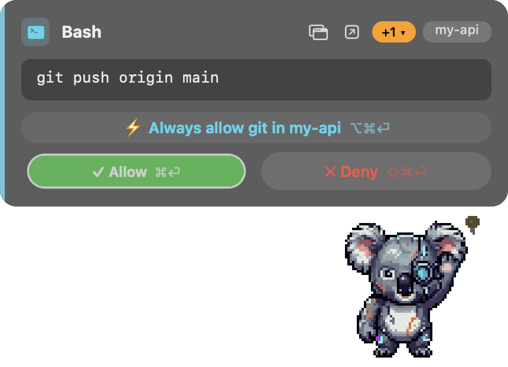

# Claude Menu Bar Buddy

A hardware-free, native macOS companion for [Claude Code](https://claude.com/claude-code): a desk pet that fields permission requests from a card on your desktop, and shows session status, token usage and plan limits at a glance. A software-only stand-in for Anthropic's [Claude Desktop Buddy](https://github.com/anthropics/claude-desktop-buddy) — no soldering, no BLE pairing.



*A `git push` asking for permission: the full command, an always-allow-in-this-project row, one more request queued behind (`+1`), jump-to-session and hand-off buttons — and the koala with its paw up.*

## The card

When Claude Code needs a permission decision (Bash, Edit/MultiEdit/Write, NotebookEdit, WebFetch/WebSearch, plans, questions), a styled card appears next to the pet: per-tool accent and icon, project badge, and the **full** command or red/green mini-diff in a scrollable block — anything that didn't fit is called out in red, never silently cut. The panel is non-activating: deciding steals no focus from what you're typing.

- **Global shortcuts** — ⌘⏎ allow, ⇧⌘⏎ deny, ⌥⌘⏎ the card's quiet action, ⌘M jump to the asking window. Registered only while a card is up; remappable in Settings. Holding a shortcut's modifiers visibly arms the button it would push.
- **Questions, not just permissions** — `AskUserQuestion` options become buttons (⌘1-4) answered through the tool's own `answers` field; multi-question calls are walked one at a time. Plans get their three real choices: approve each edit, approve + auto-accept, or keep planning (a deny that says *why*).
- **A queue you can reach into** — the orange `+N` badge lists what's waiting, jumps to any request (⌘1-9), and offers allow/deny-all behind a confirmation, because answering things you haven't read is what this app exists to prevent.
- **Hand off with ↗** — the native prompt appears immediately with its full options. Cards are answerable for ~60 seconds (the hook's window); after that the native prompt owns the decision and the card retires itself. Long reads belong on ↗ from the start.
- **Standing grants** — ⚡ on a Bash card remembers the base command *for that project*; ⚡ on an edit card turns on auto-approve-edits. Both are covered in detail under [the two standing grants](#the-two-standing-grants).

## The pet

Four generated pixel-art characters (cyberpunk koala, piglet, panda, cat — `Settings ▸ Appearance`), living in an always-on-top draggable window, three integer-scaled sizes. All four draw the same thirteen moods; the koala also waves at new sessions, yawns when nothing has happened for a while, and dances when the limit resets.

- **It shows what Claude is doing**: typing on a laptop while a tool runs, paw-on-chin while the model thinks, lotus pose during context compaction, wide-eyed when a card is up.
- **It shows how much budget is left**: tired at 50% of the 5-hour limit, stressed at 70%, running on fumes at 85%, asleep at 100% — and it celebrates the rollover.
- Pettable (heart eyes), ambient fidgets with a "Calm pet" switch, occasional one-line speech bubbles with cooldowns, a compact toast when a long turn finishes.
- `generate_pets.py` + one manifest per pet (prompts, seed, character ids) rebuild every GIF from a clean checkout through the PixelLab API.
- **Quiet by design**: ~0% CPU idle. Animations pause when the screen locks or the display sleeps, transcripts are read incrementally off a per-file cache, and the menu bar keeps mood as a line of text — a GIF behind a closed menu is a pet nobody watches.

## The menu

Status and tokens today (from local transcripts), 5-hour/weekly limit bars (from the file Claude Desktop writes — gray with an age tag when stale), burn rate with a projection (`▲ 12%/h · 90% ≈ 16:40`, rollover-aware, degrades honestly when data is stale), active sessions, decision history with a weekly summary, and the two standing-grant toggles — which stay one click away on purpose, since they change what the buddy does *without asking*. Threshold and projected-limit notifications fire once per band. Everything else lives in Settings (⌘,).

**Setup check** (first run, and always in the menu): reads your actual `~/.claude/settings.json` and reports what really routes through the buddy, whether the installed hook drifted from the repo's, whether `jq` exists — failures that are otherwise silent. It also notices when Claude Code's ground shifts: a new version series, transcript fields moving, or a tool that started asking permission without passing through the card. It never edits `settings.json`; it prints the line and leaves the decision to you.

## How it works

A `PreToolUse` hook (`hook.sh`) registered in `~/.claude/settings.json`:

1. Writes the request (tool + command/diff/questions) to `~/.config/claude-menubar-buddy/request_<id>.json`
2. Polls ~55s for a response file
3. A decision in the app writes `response_<id>.json`, which the hook returns as the tool decision
4. No response in time → the hook returns nothing and Claude Code falls back to its normal prompt — additive, never a single point of failure

No BLE, no device, no cloud — just local files.

## What it can see, and what it can do

This app sits between Claude Code and your answer to "may I run this?", so its reach is worth spelling out.

**No network connections at all.** No telemetry, no update check, no API client — grep the sources for `URLSession` and there is nothing to find.

**It reads your local Claude Code transcripts** (`~/.claude/projects/**/*.jsonl`) for token counts and session activity, and `~/Library/Application Support/Claude/plan-usage-history.json` (written by Claude Desktop) for the limit bars.

**It writes what you're being asked to approve to disk.** Each pending request lands in the config directory and is deleted the moment it's answered; every decision is appended to `decisions.jsonl` (your audit trail, opened from `Settings ▸ Safety`, rotated once at ~1 MB). The directory is kept owner-only (`0700`) by both the hook and the app.

**Debug captures are off unless you ask.** The `capture_*` flag files do nothing without `CLAUDE_BUDDY_DEBUG=1` in the app's environment — they render whatever is on screen, which can be a diff carrying a credential. `CLAUDE_BUDDY_CONFIG_DIR` points a test instance at an isolated config directory so the real queue, hotkeys and decision log are never shared with props.

**No invasive macOS permissions.** No Accessibility, no Screen Recording, no camera/microphone/contacts/location. It takes the approval shortcuts, and only while a card is on screen.

**The hook fails safe, and the card knows the window.** A timeout, an error, or the app not running all mean Claude Code falls back to its own prompt — nothing is ever approved because something broke. The card is answerable for the same ~60s the hook listens; past that it retires itself rather than collect a decision nobody would receive, and the log gains no entry claiming otherwise.

### The two standing grants

Both approve things without showing a card, and both stay visible in the menu bar while active — a grant you can't see is a grant you'll forget you gave. Neither applies while the app isn't running.

**Always allow `<command>`** remembers one base command in `always_allow.json`. It only ever speaks for a single command: anything carrying `;` `&` `|` `<` `>` `(` `)` `` ` `` `$` `\` or a newline gets a card regardless of its first word. Keep it to things that read and navigate — an interpreter on the list (`python`, `node`) is equivalent to allowing everything. Two scopes:

```json
{
  "global":   ["ls", "grep"],
  "projects": { "/Users/you/repos/api": ["gh", "npm"] }
}
```

The card only writes into `projects`, keyed on the session's absolute path and matched exactly — a grant on `/repos/api` reaches neither `/repos/api-x` nor another checkout. Widening to `global` is a confirmed action in `Settings ▸ Safety`, where the list is also readable and removable.

**Auto-approve Edits** lets edit tools through without a card, with a ✏️ on the icon while it's on. It stops at the files that decide what runs on this machine tomorrow: `~/.ssh`, `~/.gnupg`, LaunchAgents/Daemons, `.git/hooks`, `~/.claude`, shell startup files, system directories — and the buddy's own config, so an auto-approved write can't widen the very grant that let it through. Relative paths and `..` get a card too: "can't tell where it lands" means "ask".

## Tests

```bash
swift test   # Swift Testing — Command Line Tools are enough, no Xcode
```

Forty tests guard the promises above: a fixture harness runs the **real `hook.sh`** in a throwaway `$HOME` (metacharacters must always reach a card, protected paths must survive auto-edits, allow/deny/answer round-trips), the burn-rate math is pinned to the shapes real data produced (window rollovers included), and every species × mood is audited against the shipped GIFs in both directions.

## Install

See [`SKILL.md`](./SKILL.md) — written as a self-install skill for Claude Code itself: clone, open in Claude Code, ask it to read `SKILL.md` and install. It builds with `swift build`, installs the hook, merges the `PreToolUse` config (never overwriting yours), registers a login item and launches. Editing `settings.json` is intentionally never auto-approved by a hook.

Manual install:

```bash
git clone <this-repo> && cd claude-menubar-buddy
.venv/bin/python3 generate_pets.py <koala|piglet|panda|kitty>   # only to regenerate art (PixelLab key)
swift build
mkdir -p ~/.config/claude-menubar-buddy
cp hook.sh ~/.config/claude-menubar-buddy/ && chmod +x ~/.config/claude-menubar-buddy/hook.sh
```

Then merge the `hooks.PreToolUse` block from `SKILL.md` into `~/.claude/settings.json` (real home directory in the path, not `~`), and optionally the LaunchAgent plist for start-at-login.

**Requirements**: macOS 13+ · Swift 5.9+ (Command Line Tools) · `jq` · Python 3 + Pillow only to regenerate GIFs.

## Project layout

```
Sources/BuddyCore/            # pure logic under test: burn-rate math, mood policy
Sources/ClaudeMenuBarBuddy/
  main.swift                  # bootstrap, AppDelegate state, poll loop
  ApprovalCard.swift          # card assembly and lifecycle
  CardLayout.swift            # card visual vocabulary (pills, accents, diff styling)
  CardDecision.swift          # what answering does: respond, verdict, audit log
  Menus.swift                 # the dropdown and its in-place refresh
  Queue.swift                 # the waiting line: pick one, answer all
  FloatingPet.swift           # desktop pet window · Fidgets / SpeechBubble / Toast
  MoodEngine.swift            # signals → mood → GIF
  BurnRate.swift              # the burn line + projected-limit notifications
  Health.swift                # setup check + update-drift detection
  SettingsWindow / Onboarding / StatusIcon / HotKeys / JumpToHost / Prefs / UsageStats / DecisionStats
  Resources/                  # generated GIFs + species.txt (checked in)
Tests/ClaudeMenuBarBuddyTests # hook fixtures, burn-rate shapes, art audit
hook.sh                       # the PreToolUse hook
notify-done.sh                # UserPromptSubmit/Stop/PreCompact hook
generate_pets.py              # regenerates all pet art via PixelLab
<pet>_manifest.json           # prompts, seed, character ids, crop box per pet
```

## Uninstall

```bash
launchctl bootout gui/$(id -u)/com.claudemenubarbuddy.app
rm ~/Library/LaunchAgents/com.claudemenubarbuddy.app.plist
rm -rf ~/.config/claude-menubar-buddy
```

Then remove the `hooks.PreToolUse` entries pointing at `hook.sh` from `~/.claude/settings.json`.

## Why this instead of the hardware Buddy

They're complementary. This one needs no hardware or pairing, covers Claude Code's permission hooks directly (which the BLE bridge doesn't see), and compiles from source — nothing to notarize. If a hardware Buddy is also paired they don't conflict: this hook resolves first, and on timeout the request falls through to the prompt the hardware Buddy watches.

## License

[MIT](./LICENSE) — use it, fork it, modify it freely.

All four current pets are original art generated for this project via PixelLab (see the manifests). Earlier versions rendered 18 additional pets from ASCII-art poses in Anthropic's [claude-desktop-buddy](https://github.com/anthropics/claude-desktop-buddy) firmware (© 2026 Anthropic, PBC, MIT) — retired in `1d4636f`, still in the git history.
